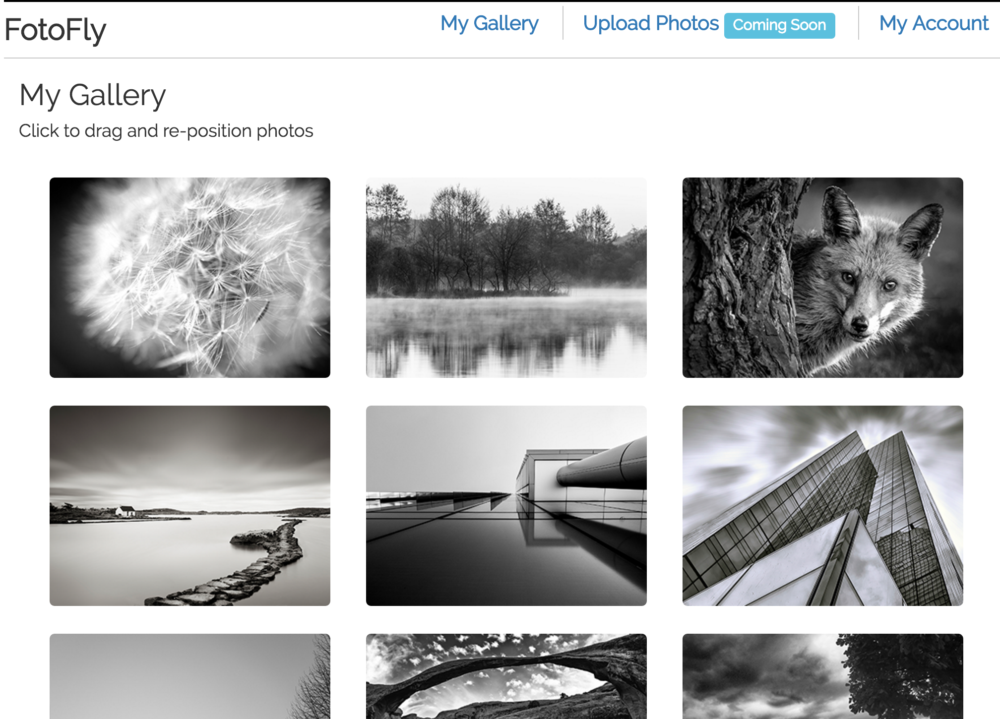

# FotoFly

> FotoFly is an online photo gallery.  User can upload photos and click/drag the photo to reposition it in the gallery.



## Tech Stack

1. Node/Express
1. PostgreSql (Coming soon)
1. JavaScript (Purposely built with plain, vanilla JavaScript on the front-end)

## Features To Add

1. Upload photo functionality
1. Authentication
1. Database

## Table of Contents

1. [Usage](#Usage)
1. [Requirements](#requirements)
1. [Development](#development)
    1. [Installing Dependencies](#installing-dependencies)

## Usage

To start the app:

```sh
npm start
```

## Requirements

- Node 6.2.2

## Development

### Installing Dependencies

From within the root directory:

```sh
npm install
```

### Run Webpack

From within the root directory:

```sh
npm run compile
```
